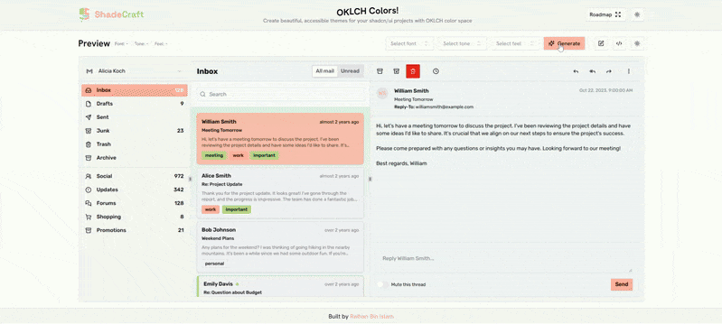

# ShadeCraft

⚠️ **Work in Progress:** The codebase is evolving and might not be fully polished yet.  
Contributions and feedback are very welcome!

Generate a complete, accessible Shadcn UI theme in **1 click** — powered by OKLCH color science.  
Supports light/dark mode, real-time editing, and instant Tailwind config export.

🚀 **Live Demo:** [shade-craft.vercel.app](https://shade-craft.vercel.app)



## Quick Start

```bash
# Clone the repository
git clone https://github.com/raihan-bin-islam/ShadeCraft.git
cd ShadeCraft

# Install dependencies
npm install
# or
yarn
# or
pnpm install

# Start the development server
npm run dev
# or
yarn dev
# or
pnpm dev
```

## Why ShadeCraft?

Customizing Shadcn UI to match your brand often takes hours of tweaking CSS variables.
ShadeCraft turns that into one click — generating beautiful, accessible themes instantly.

### Features

- Advanced Color Harmonies – Analogous, Complementary, Triadic, Tetradic, Monochromatic, Split-Complementary
- OKLCH Color Space – Perfectly balanced, accessible colors
- Dark/Light Mode – Automatic dual theme generation
- Flexible Output – Export as CSS variables or JSON
- Chart Colors – Matching data visualization palette
- Lets you tweak colors in real time — with radius and tone editing coming soon.

### Available Color Harmonies

- `"analogous"` - Colors that are adjacent to each other on the color wheel
- `"complementary"` - Colors that are opposite each other on the color wheel
- `"triadic"` - Three colors equally spaced around the color wheel
- `"tetradic"` - Four colors arranged into two complementary pairs
- `"monochromatic"` - Different shades and tints of a single color
- `"split-complementary"` - A color and two colors adjacent to its complement

### Theme Structure

The generated theme includes variables for:

- Primary, secondary, and accent colors
- Background and foreground colors
- Card, popover, and sidebar components
- Muted and destructive states
- Input and border styles
- Chart colors for data visualization

### Upcoming Features

- **Palette Generator From Brand Color**: Visual interface for creating color palettes from a single brand color
- **Theme Export Options**: Additional export formats including Tailwind config
- **Accessibility Checker**: Built-in tools to verify WCAG compliance for generated themes
- **Theme Sharing**: Ability to share themes via URL or community gallery
- **Component Preview**: Live preview of all shadcn/ui components with your theme applied
- **Theme Version Control**: Save and track changes to your themes

### Contributing

Contributions are welcome! Please feel free to submit a Pull Request.
See [Contributing](#contributing) for how to help improve ShadeCraft.

⭐ If you find this useful, please star the repo to help others discover it!

### License

[MIT](LICENSE.txt)
